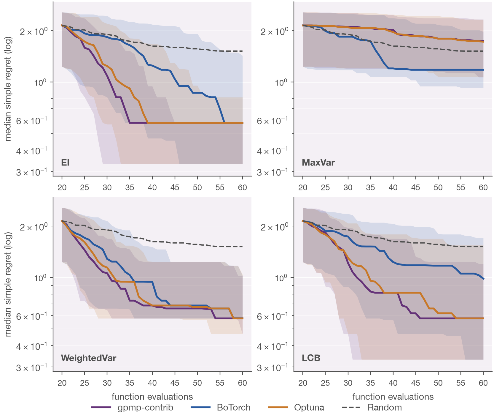
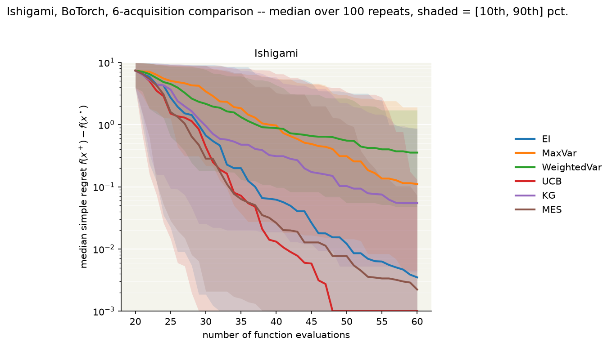
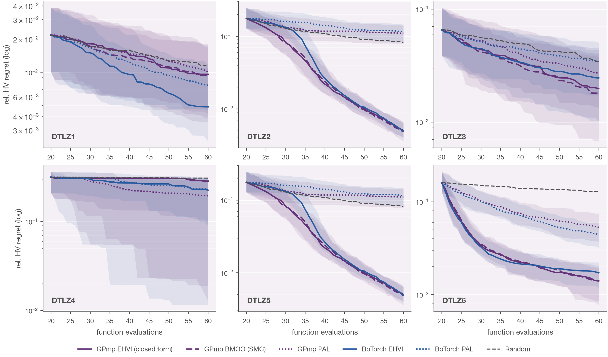
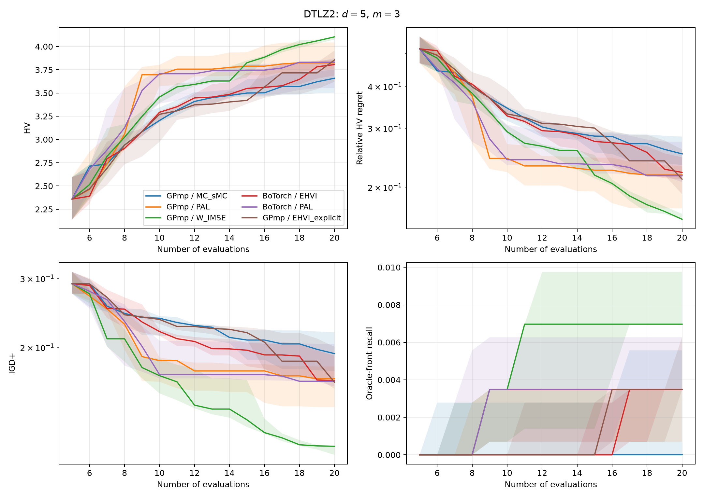
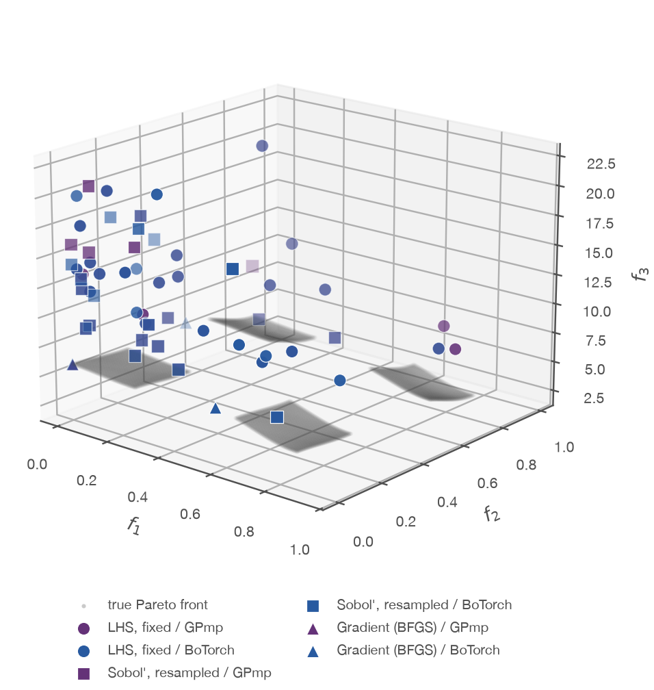
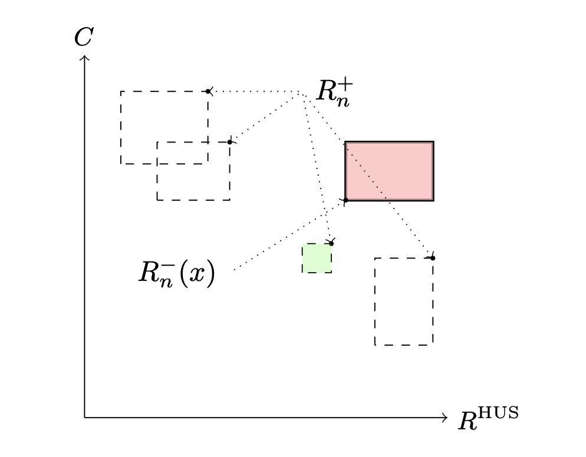
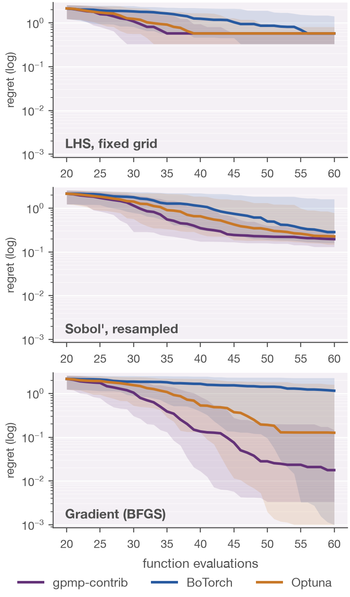
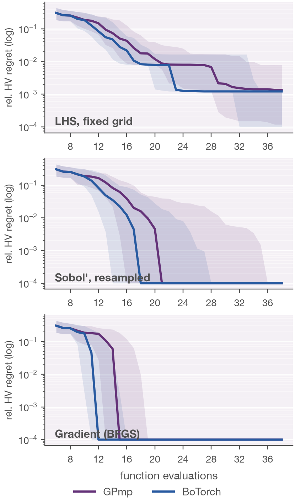

# Bayesian optimization library comparison

Benchmarks [gpmp-contrib](https://github.com/gpmp-dev/gpmp-contrib) against
BoTorch and Optuna on two problems: single-objective Bayesian optimization
(`bo/`) and multi-objective Bayesian optimization (`bmoo/`). Both phases pin
every library to the same GP estimator (plain maximum likelihood) and the
same candidate grid, so any gap between libraries reflects the GP model or
the acquisition, not incidental differences in search machinery.

GP hyperparameters are fit by plain maximum likelihood: β (constant mean),
σ² (variance) and ρ (lengthscale, one per dimension) are fit this way;
ν (Matérn smoothness, `nu=2.5` everywhere) is fixed, not fit -- no library
exposes a gradient for it, and it isn't separately identifiable from ρ by
MLE anyway. See `bo/README.md` and `bmoo/README.md` for every other choice.

## Results

**BO**: gpmp-contrib vs BoTorch vs Optuna, 4 shared acquisitions (EI, MaxVar,
WeightedVar, UCB) plus 2 BoTorch-only ones (Knowledge Gradient, Max-value
Entropy Search).




**BMOO**: GPmp vs BoTorch, EHVI (closed-form and a hand-built Monte-Carlo
estimator, see `bmoo/README.md`) and Pareto Active Learning (PAL), across
the DTLZ1-6 family.






**Candidate strategy**: does the acquisition's own optimizer matter, or
just the GP model? Both phases run the same ablation -- "LHS, fixed grid"
(argmax over a static candidate set) vs "Sobol, resampled" (candidates
redrawn every iteration) vs "Gradient (BFGS)" (continuous L-BFGS-B
multistart) -- across every library, holding the acquisition fixed (EI for
BO, EHVI for BMOO). `bo/grid_ablation.py` and `bmoo/candidate_ablation.py`;
see each folder's README for the exact protocol.




## Layout

```
src/       code shared by both phases: process-pool parallelism (src/parallel.py)
bo/        single-objective BO comparison -- see bo/README.md
  src/     bo-specific library code (backends, test problems, acquisition math)
  *.py     experiment scripts, run directly: compare.py, grid_ablation.py, ...
bmoo/      multi-objective BO comparison -- see bmoo/README.md
  src/     bmoo-specific library code (backends, test problems, PAL, metrics)
  *.py     experiment scripts, run directly: compare.py, candidate_ablation.py, ...
results/   the images above
```

## Setup

```bash
# gpmp and gpmp-contrib aren't on PyPI: clone them as siblings of this repo
git clone https://github.com/gpmp-dev/gpmp.git
git clone https://github.com/gpmp-dev/gpmp-contrib.git

conda create -n gpmp_env python=3.11
conda activate gpmp_env
python -m pip install -r requirements.txt   # single requirements file for bo/ and bmoo/
```

Then, from `bo/` or `bmoo/`:

```bash
python3 compare.py            # quick sanity-check run with small defaults
jupyter notebook *.ipynb      # walkthrough notebook
```

See `bo/README.md` and `bmoo/README.md` for every script and its CLI
arguments.
